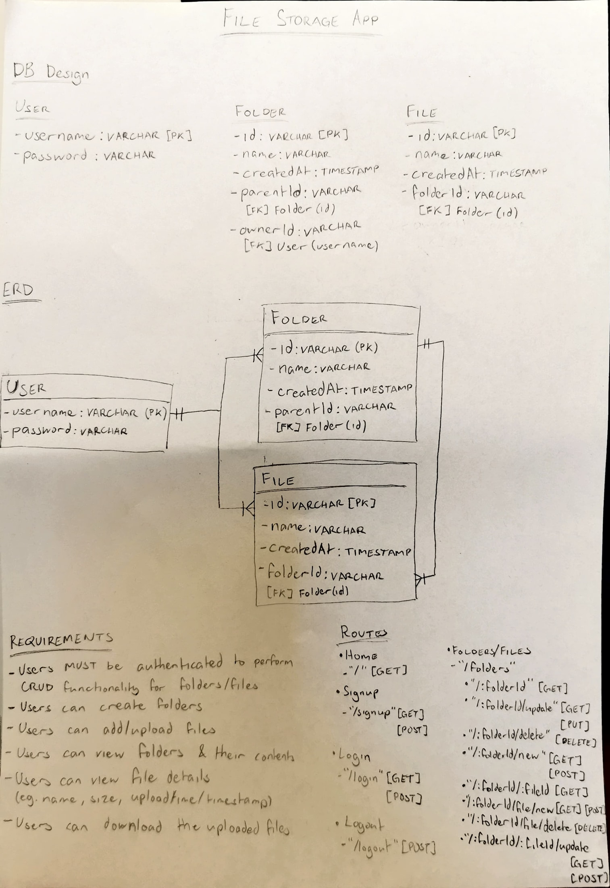

# storage-web-app

The repository contains a simple storage app demonstrating use of authentication, file uploading &amp; Prisma ORM.

## Technologies Used

- Node
- Express
- Prisma
- PostgreSQL
- JavaScript
- EJS
- CSS

## Installation

1. **Clone the repository**:

   ```bash
   git clone https://github.com/ishmyles/storage-web-app.git
   cd storage-web-app
   ```

2. **Install dependencies**:

   ```bash
   npm install
   ```

3. **Set up environment variables**:

   Create a `.env` file in the root directory and add the following variables:

   ```env
    PORT=3000
    STORAGE_FOLDER= <Add destination folder for multer to save files locally>
    DB_STRING="postgres://<DB_USERNAME>:<PASSWORD>@localhost:5432/<DB_NAME>"
    COOKIE_SECRET= <Enter a password>
    SALT=10
    DATABASE_URL="postgres://<DB_USERNAME>:<PASSWORD>@localhost:5432/<DB_NAME>"

    PORT=3000
    MEMBER_SECRET= <Enter a password>
    ADMIN_SECRET= <Enter another password>
    DB_CONN="postgres://<DB_USERNAME>:<PASSWORD>@localhost:5432/<DB_NAME>"
    COOKIE_SECRET= <Enter another password>
    SALT_KEY=10

   ```

4. **Start the application**:

   ```bash
   node --watch --env-file .env app.js
   ```

   The app will be accessible at `http://localhost:3000`.

5. **Terminating the application**:

   Press Ctrl + C to terminate app.

## App Design


